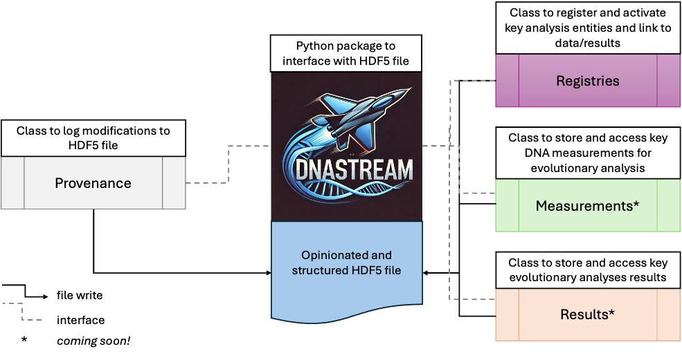

# DNAStream

DNAStream is an HDF5-backed, multi-modal data structure for organizing DNA sequencing data and downstream evolutionary analysis. It provides compact on-disk storage, fast partial reads, and a structured way to track entities, links, and changes over time.

## Beta scope

This beta release focuses on:
- **Registry**: typed registries with built-in schemas for core entities (e.g., samples, variants, SNPs) and activation status
- **Provenance**: lightweight event logging for dataset changes (**create**, **append**, **modify**, **designate**)

Expect the API and on-disk layout to evolve during beta.


*Beta includes Registry + Provenance. Measurements and Results are planned (marked with * in the diagram).*

## Key features

- **Efficient storage and access** via a chunked HDF5 file with lazy reads for large cohorts
- **Entity registries with schemas** to validate fields, manage activation, and support consistent linking across datasets and analyses
- **Provenance logging** of change events to support reproducibility and collaboration

## Coming soon

- **Measurements** linked to registered entities (e.g., variant/total read counts, binned counts)
- **Results** storage and retrieval (e.g., copy number calling, clonal trees)
- **Canonical result pointers** to mark the active/preferred outputs among multiple runs
- **Custom schemas** for specialized registries, measurements, and results
- **Multi-user workflows** with a clear concurrency policy for write access


## Table of Contents
- [Dependencies](#dependencies)
  - [Optional dependences](#optional-dependencies)
- [Installation](#installation)
- [Quickstart](#quickstart)
- [Documentation](#documentation)
- [Unit tests](#unit-tests)


## Dependencies
`DNAStream` has the following dependencies. These will be automatically installed during installation. *Pinned versions to be determined later.*
 - `h5py`
 - `numpy`
 - `pandas`

### Optional dependencies

To view the [documentation](#documentation) locally:
  -  `mkdocs>=1.5`
  - `mkdocs-material>=9`
  - `mkdocstrings[python]>=0.25`

```bash
pip install ".[docs]"
```

To run the test suite:
  - `pytest>=7`

```bash
pip install ".[test]"
```

For developers, all of the above dependences plus:
  - `black>=24`

```bash
pip install -e ".[dev]"
```


## Installation

Create a conda/mamba environment (recommended) and install the package from the Github tagged release. 

```bash
conda create -n dnastream python=3.11
conda activate dnastream 
pip install "git+https://github.com/VanLoo-lab/DNAStream.git@v0.1.0-beta"
```


Verify the installation. 

```
python -c "import dnastream; from dnastream import DNAStream; print('dnastream', dnastream.__version__)"
```

 Package is ready to use if no errors occurred!


## Quickstart
The beta release is focused on **Registry** and **Provenance**. The minimal example below creates a file, appends rows to a registry, iterates decoded rows, and inspects recent provenance events.

```python
from dnastream import DNAStream
myfile = "myfile.h5"

#Create a new DNAStream HDF5 file, user warning if file already exists.
DNAStream(myfile, mode="x").create()
```

Outside of `create` it is recommended to connect with a context manager. 
Here we add to entities to the built-in `sample` registry.

```python
with DNAStream(myfile, mode="r+", verbose=True) as ds:

    #pointer to the built-in sample registry
    reg = ds.sample

    reg.add([
        {"sample_name": "S1", "modality": "bulk"},
        {"sample_name": "S2", "modality": "single-cell"},
    ])

    print(f"Sample registry contains {len(reg)} entities")
```

We can also add variant entitites to the `Variant Registry` and iterate through the registry, extracting key information.

```python
with DNAStream(myfile, mode="r+", verbose=True) as ds:
       
    ds.variant.add([
        {"chrom": "chr1", "start_pos": 1231, "end_pos": 1232, "ref_allele": "A", "alt_allele": "T"},
    ])

    for snv in ds.variant:
        print(f"SNV id: {snv['id']}, SNV label: {snv['label']}, active {snv['active']}")
```

Then we can inspect the provenance log to see all modifications to the `DNAStream` file.
```python
with DNAStream(myfile, mode="r+", verbose=True) as ds:
    
    # pointer to the built-in provenance modification log
    log = ds.log


    # #extract the entire registry to a dataframe
    event_log_df = log.to_dataframe()
    print(event_log_df.head())

```

We can also iterate through a `Registry` or `Provenance` object to obtain a dictionary of each entry:


```python
with DNAStream(myfile, mode="r", verbose=False) as ds:
    for row in ds.sample:
        print(row)

    for event in ds.log:
      print(event)
```


## Documentation

During the beta phase, the documentation is not yet published on GitHub Pages. You can build and serve the docs locally with MkDocs.

Install the optional documentation dependencies:

```bash
pip install -e ".[docs]"
```

Then serve the documentation locally:
```bash
mkdocs serve
```


MkDocs will print a local URL such as:

`INFO    -  [10:31:55] Browser connected: http://127.0.0.1:8000/`

Open that address in your browser to view the docs.


# Unit tests
If the [optional dependences](#optional-dependencies) are installed for the test suite, then the package can be tested with:

```bash
pyest
```
