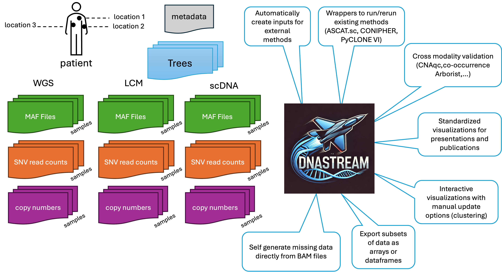

# Welcome to DNAStream
DNAStream is a multisample, multiplatform DNA sequencing HDF5 data structure for integrated downstream evolutionary analysis. 

For the source code, visit [https://github.mdanderson.org/llweber/DNAStream](https://github.mdanderson.org/llweber/DNAStream).

See [https://pages.github.mdanderson.org/llweber/DNAStream/](https://pages.github.mdanderson.org/llweber/DNAStream/) for the API.




## Dependencies
 - `h5py`
 - `numpy`
 - `pandas`


## Schema (under development)
The schema is currently underdevelopment is subject to change but below is the currently implemented or prospective design (*). 
```
/
/
 ├── SNV/                     # Shared SNV index
 │   ├── labels               # Short name chr:pos:ref:alt
 │   ├── data                 # Structured array: quality scores, active
 │   ├── cluster              # Integer cluster assignments
 │   ├── log                  # Index modification log
 ├── sample/                  # Sample index
 │   ├── labels               # Sample names
 │   ├── data                 # Structured array: patient ID, source, location, file paths
 │   ├── cluster              # Integer cluster assignments
 │   ├── log                  # Index modification log
 ├── tree/
 │   ├── SNV_trees/  
 │   │   ├── trees            # Variable-length edge lists of clusters
 │   │   ├── data             # Likelihood, rank, method used to generate, etc.
 │   │   ├── labels           # Tree labels
 │   ├── CNA_trees/     
 │   │   ├── trees            # Variable-length edge lists (or Newick strings)
 │   │   ├── data             # Likelihood, rank, method used to generate, etc.
 │   │   ├── labels           # Tree labels
 ├── copy_numbers/
 │   ├── bulk/
 │   │   ├── labels           # Segment labels (chrom, start, end)
 │   │   ├── index            # Bulk-specific segment index
 │   │   ├── profile          # 3D array: (segment, sample, allele-specific CN)
 │   │   ├── logr             # 2D array: (segment, sample) logR values
 │   │   ├── baf              # 2D array: (segment, sample) B-allele frequency
 │   │   ├── log              # Modification log
 │   ├── lcm/
 │   │   ├── labels           # Segment labels
 │   │   ├── index            # LCM-specific segment index
 │   │   ├── profile          # 3D array: (segment, sample, allele-specific CN)
 │   │   ├── logr             # 2D array: (segment, sample) logR values
 │   │   ├── baf              # 2D array: (segment, sample) B-allele frequency
 │   │   ├── log              # Modification log
 │   ├── scdna/
 │   │   ├── labels           # Segment labels
 │   │   ├── index            # Single-cell segment index
 │   │   ├── profile          # (sample, segment) → allele CN tuple
 │   │   ├── log              # Modification log
 ├── read_counts/
 │   ├── variant              # 2D array: (SNV, sample) variant read counts
 │   ├── total                # 2D array: (SNV, sample) total read counts
 │   ├── log                  # Read count modifications log
 ├── metadata/
 │   ├── log                  # Metadata modifications log
 │   ├── sample_info          # Sample metadata
 │   ├── processing_parameters # Processing parameters used in analysis

```